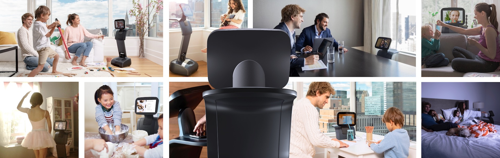

Object Detection and Localization on a Temi Robot
========

(Copyright image: [Temi](https://www.robotemi.com/))

This repository is used to store the proof-of-concept and all the relevant resources for the thesis "Towards a Smarter Robot".
With this research we implemented object detection and localization on a Temi robot, thus making it a smarter robot.

The repository contains the following resources:
- The proof-of-concept Android application;
- Raw photos used during evaluation data and the results of the evaluation;
- The converted YOLOv8 models in NCNN format.

For more information about the Temi robot see [their developer documentation](https://www.robotemi.com/developers/).

-----
## Android application
The Android application created for this project was based on the Temi SDK sample application, which can be found [here](https://github.com/robotemi/sdk/). 
The application was modified to include the YOLO object detection model and object localization via triangulation.

### Starting the application
To run this proof-of-concept, you need to have a Temi robot and have Android Studio installed on your computer.
The application can be run on the robot by connecting the robot to the computer via ADB, this requires using the developer tools to open the remote ADB port on the Temi robot.
After that, start the application with the play button in Android Studio.

Extended information on how to run the application can be found in a document made by me and Friso Turkstra called run_app.pdf.

-----
## Evaluation data
During the two evaluation sessions we evaluated both the object detection model and the ability of the robot to localize an object in an environment. The raw and analyzed photos taken by the Temi robot including their metadata used for this evaluation can be found in the folder `evaluation_data`.

### Object detection data
For each of the photos analyzed by the YOLOv8 model we noted the TP, FP, and FN values. This allowed for a calculation of the precision, recall, and F1-score per photo. Besides that with this data we could calculate the average recall per unique object. The data can be found in the folder `evaluation_data/object_detection`.

### Localization data
To evaluate the localization of the robot we compared the estimated location of a object compared to the actual positon of a object. The estimation was done with a triangulation method that we employed. The estimated location was noted after a scanning session for each technique and configuration and was compared with the actual position. The data can be found in the folder `evaluation_data/localization`.

-----
## Converted models
During this research we converted two different YOLOv8 models to NCNN format so that we could use them in our Android Application. These converted models can be found in the folder`models`.
- Yolo Extra-large: `yolov8c.bin` and `yolov8c.param` -> used as default model;
- Yolo Small: `yolov8s.bin` and `yolov8s.param`.

-----
## References
Temi SDK used to communicate with the Temi robot & the example app this app was based on. https://github.com/robotemi/sdk/

YOLO v8 model used in the application. https://github.com/ultralytics/

NCNN format used in the application to use the YOLOv8 model. https://github.com/Tencent/ncnn

OpenCV for image loading and processing. https://github.com/opencv/opencv

YOLOv8 implementation on Android using NCNN. https://github.com/FeiGeChuanShu/ncnn-android-yolov8

Nanodet implementation. https://github.com/nihui/ncnn-android-nanodet

ChatGPT and GitHub Copilot general programming help such as advanced position calculations.